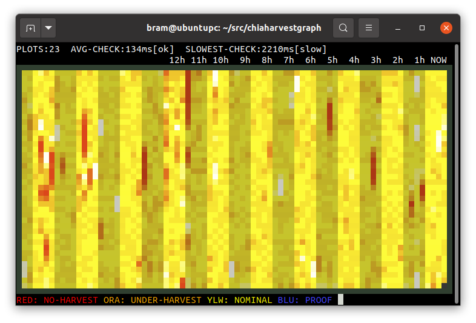

# Flax Harvest Graph
Monitor for Flax Harvesting




## Introduction

The flaxharvestgraph tool will graph Flax Harvesting activity in a linux terminal. Use a 24-bit colour terminal, like xterm or gnome-terminal.


## Building

```
$ git clone https://github.com/stolk/flaxharvestgraph.git

$ cd flaxharvestgraph

$ make
```

## Launching

To use it:

Set the loglevel for Flax to **INFO** by editting `~/.flax/mainnet/config/config.yaml` and make sure you have `log_level: INFO` set.

Then do:

**$ ./flaxharvestgraph ~/.flax/mainnet/log**

Leave the tool running, as it keeps checking the log. More pixels will scroll in from the right, plotting top to bottom.

**PRO TIP**: Don't scale your terminal higher than 25 lines, because the image will get noisy due to small time-bins. Terminal of 15 lines or so is best, in my experience.

## Rationale

Much can go wrong when harvesting Flax.
The full node may lose connection to peers, the farmer could not be talking to the full node, the harvester could not be talking to the farmer, or maybe just spotty Internet connection?

That's why it is important to keep an eye on the INFO log.
When challenged, the harvester will (on behalf of a farmer) look for proof.
It will look for that in the plots that pass the plot-filter.
(Every plot has a 1:512 chance of passing, by the way.)

The debug log will contain lines that look like:
```
0 plots were eligible for farming 3c91c49224... Found 0 proofs. Time: 0.00383 s. Total 39 plots
```

A properly working harvester should be outputting that line every 10 seconds or so to the log file (provided the log level is INFO.)

This tool will look for those lines in the logs.

## Function

A Flax Harvester will get challenged every 10 seconds or so, to look for proof in its plots.
This tool will identify those lines, and register the time-stamps for those.
If there are not enough of those time-stamps within any given period, the harvester is under-harvesting, or even not harvesting. This is colour coded on the graph.

The graph spans from the right of the terminal (NOW) to the left of the terminal (PAST) and every shaded band represents one hour, and every vertical line, one quarter of an hour.

Depending on the vertical resolution of the terminal, every plot pixel represents a number of seconds, 15 minutes from top to bottom.

On the top of the screen, the average and worst-case response times to eligible harvests are shown. If your harvester takes more than 5 seconds to respond to a challenge, it is designated as too slow.

**NOTE:** You can see more days of the week by simply resizing your terminal to be wider.

**NOTE:** First time users should not be alarmed by a lot of grey colour on the left side of the screen. Flax logs are at most 7 x 20MB, and because a full node spams a lot, there are only a few hrs of info in there. On a dedicated harvester, there can be weeks of info, because it logs less. Regardless.... if you leave the tool runnining, it will hold onto the stats, up to a week's worth.

## Colours

A yellow colour means that the harvest frequency is nominal for that time span.

An orange colour means that it was under harvested.

A red colour means that there was no harvesting at those time slots.

A white colour means that there was a bit more than expected harvesting, due to fluctuations.

Dark Grey means that the log did not go far enough back for that time period.

And for the incredibly lucky... a blue pixel represents a found proof! Yeehaw!
Better check your wallet!

## Keys

Press ESCAPE or Q to exit flaxharvestgraph.

## Environment Variables

If you have trouble seeing the standard colourmap, you can select a different one:

```
$ CMAP_VIRIDIS=1 ./flaxharvestgraph ~/.flax/mainnet/logs
$ CMAP_MAGMA=1 ./flaxharvestgraph ~/.flax/mainnet/logs
$ CMAP_PLASMA=1 ./flaxharvestgraph ~/.flax/mainnet/logs
```

If you have more than 8 recycled debug.log files, then you can tell the tool to read more of them:
```
$ NUM_DEBUG_LOGS=15 ./flaxharvestgraph ~/.flax/mainnet/logs
```

## Running from Docker

First, build it

```
docker build -t flaxharvestgraph:latest .
```

Then run it

```

```bash
docker run -v ~/.fkax/mainnet/log:/.fkax/mainnet/log:ro --name=fkaxharvestgraph -it fkaxharvestgraph:latest bash
```

## Donations

Flax Harvest Graph is a tool by Bram Stolk, ported from Chia to Flax by Luca Simonetto

If you find this tool useful, donations can go to XFX wallet:
xfx18hzk3hw7eq4s0gxz9fgftamls30awsz0h0swqzfhy9vwk0x7xymqcskwrw

## Known issues

* Shows garbage on terminals that do not support 24 bit colour.
* Missing manual page.
* It looks [weird](https://imgur.com/a/GkzPie2) when going through older versions of putty, so upgrade putty.
* If your terminal lacks 24-bit support, and can't switch to xterm or another 24-bit terminal, run the tool through tmux.

## Copyright

flaxharvestgraph is (c)2021 by Bram Stolk and licensed under the MIT license.
